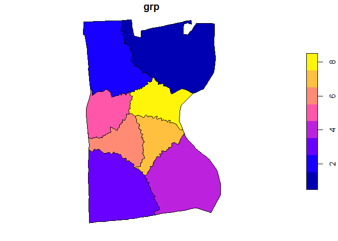

Subset Polygons
================

## Subset Polygons

This is a bit of code intended to mimick the existing ESRI [subset
polygons](https://pro.arcgis.com/en/pro-app/latest/tool-reference/geostatistical-analyst/generate-subset-polygons.htm)
function. The intended use is obtaining non-overlapping polygons with an
equal number of points in each area. The general algorithm is:

1.  Use iterative nearest neighbors to identify equal sized clusters
2.  Create a thiessen tessellation around all points
3.  Merge and dissolve thiessen polygons by cluster id

## Example

Here is an example using a random sample of calls for service data from
Hartford, CT in 2020. The goal is to identify 8 patrol areas with an
equal number of calls for service.

``` r
library(sf)
library(tidyverse)

source("C:/Users/gioc4/Dropbox/subset_polygons/subset_polygons.R")

# find polygons that make 8 equal-sized groups
# based on calls for service
cfs_groups <- subset_polygons(p = cfs, 
                              a = hartford, 
                              g = 8, 
                              plot_map = T, 
                              data_return = "point")
```

<!-- -->

``` r
# check size of groups
table(cfs_groups$grp)
```

    ## 
    ##   1   2   3   4   5   6   7   8 
    ## 625 625 625 625 625 625 625 625
